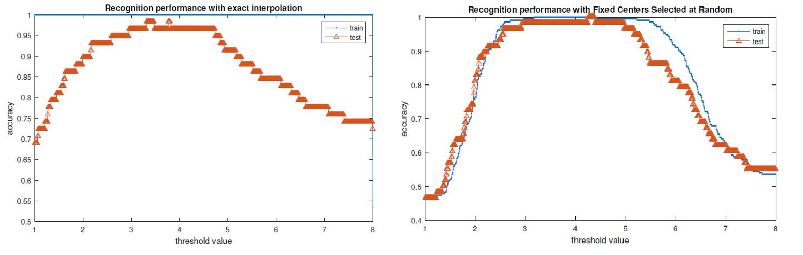

# Radial-Basis Function Network for handwritten number classification

### Synopsis ###
This project took place during the module _Neural networks_ at NUS (EE5904R).
The goal of this project is to classify handwritten digits (from 0 to 9) from MNIST dataset by using a Radial-Basis Function Network. 

Radial-Basis Fonction Network is an artificial neural network that uses Radial-Basis Functions (RBF) as activation function. It has three layers: 

* an input layer
* a hidden layer with RBF activation function
* linear output layer

The output of the network is a linear combination of radial basis functions of the inputs and neuron parameters. The following image illustrates this structure:

  

Each hidden unit is defined by a center and a spread/width. Each center is a sample taken from the training set. The activation of a hidden unit is determined by the distance between an input vector _x_ and the center of the hidden unit. The closer they are, the higher the activation of the hidden unit is. It explains the Radial-Basis function behavior as activation function. 

The learning process consists of two stages:

1. Parameterize the hidden units: define their center and width. It can be done by random selection or clustering. The centers are directly taken from the training dataset.
2. Find weight values between hidden and output units by computing the _interpolation matrix_.

### Results ###

The RBFN has been used to classify handwritten digits 1 and 8 only (MNIST dataset by extracting the samples of label other than 1 and 8). For each sample, the network gives a real output and a threshold is used to separate the predictions as label 1 and the predictions as label 8. The resulting error rate/accuracy of the prediction depends on the threshold. 

Two different types of hidden units have been tested (stage 1 of the learning process):

* exact interpolation: we define as many hidden units as there are training samples and the center of each hidden unit is a training sample
* 'Fixed Centres Selected at Random' method: M training samples are chosen randomly to define the centers of the hidden unit

The results are the following:

  

We can notice that the recognition performance is 1 for the training set regardless of the threshold value with the exact interpolation method. Indeed there is an exact fitting between the output of the RBFN and the labels of the training samples.
Concerning the 'Fixed Centres Selected at Random' method, the accuracy of the training set is not as perfect as the one found with the exact interpolation. Indeed, there is no exact fitting anymore due to the smaller number of hidden units. It leads to a better result for the test set.

In a nutshell RBFN may be convenient to fit a given dataset (very high accuracy for the training set) but may overfit! One has to choose the right number of hidden unit (not too high) and to use regularization. 

### Project content ###

Content of this project: 

* 'MNIST_dataset.mat': MNIST dataset
* 'init.m': Matlab script to initialize the program (load the dataset 'MNIST_dataset.mat' into the Matlab workspace) 
* 'rbfn_standard.m': Matlab script to train a RBFN to classify the digits (with two ways of choising the centers of the RBFN)
* 'rbfn_regularization.m':  Matlab script to train a RBFN to classify the digits with regularization
* 'rbfn_tuning_std.m': Matlab script to try different values for the standard deviation that appears in the RBF
* other Matlab files ('.m' extension): Matlab functions and scripts to run the program

To make the program run: 

1. run _init_
2. run one of the Matlab scripts _rbfn_standard_ / rbfn_regularization_ 

### Author ###

Mareva Brixy (marevabrixy@gmail.com)
